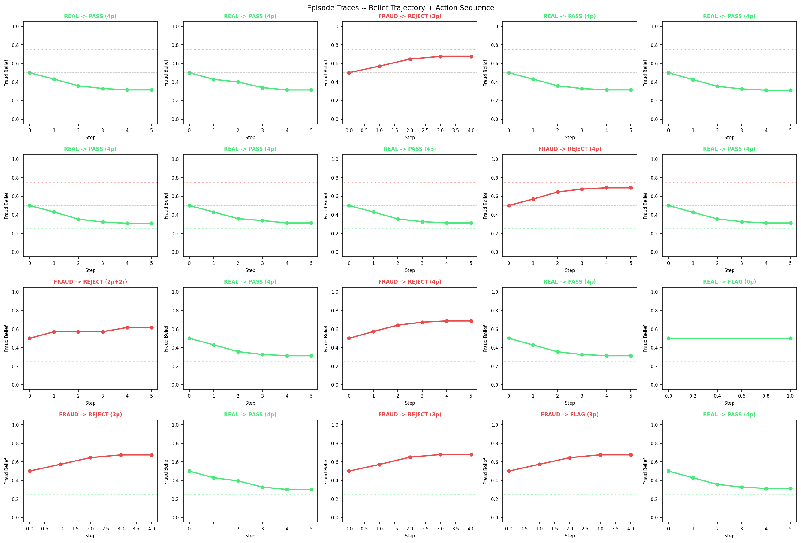

# KIVE — Knowledge Integrity Verification Engine
# Sentinal | Mayank Pratap Singh | steeltroops.ai@gmail.com

## What This Is

KIVE is an RL-based expert fraud detection system built for the ProNexus ML Engineer
assignment. It frames vetting as a Partially Observable MDP (POMDP) where an agent
collects 5 behavioral signals, then decides to PASS / REJECT / FLAG or PROBE a candidate.

The core thesis: **AI-assisted human fraud is not detected by perplexity scores.**
It is detected by behavioral anomalies in professional trajectory, specificity variance,
and operational memory — all of which are adversarially robust because they target
external ground truth, not text-intrinsic patterns.

---

## Architecture

```
                    ┌─────────────────────────────────────┐
                    │           Orchestrator               │
                    │   (POMDP RL Agent — DQN, SB3)       │
                    │  /api/v1/orchestrator/session/*      │
                    └────────────┬────────────────────────┘
                                 │  calls all 5 in parallel
        ┌────────┬───────────────┼───────────────┬────────┐
        │        │               │               │        │
      [TAV]   [SVP]           [FMD]           [MDC]    [TSI]
     :8001   :8002            :8003           :8004    :8005
```

### Signal Services

| Signal | Port | Weight | What It Detects |
|--------|------|--------|-----------------|
| **TAV** — Temporal Anchoring Violations | 8001 | 0.28 | Claimed years of experience exceeding physical maximum given tool release dates |
| **SVP** — Specificity Variance Profile | 8002 | 0.24 | Uniform fluency across all topics (LLM pattern) vs. expert spikiness |
| **FMD** — Failure Memory Deficiency | 8003 | 0.20 | Absence of specific production failure narratives with version + root cause |
| **MDC** — Market Demand Correlation | 8004 | 0.16 | Skill timestamps clustering 0-3 months after demand spikes (retroactive inflation) |
| **TSI** — Trajectory Smoothness Index | 8005 | 0.12 | Perfectly monotone career (no lateral moves, gaps, or pivots) |

### RL Framework

- **Observation space**: `Box(shape=(6,), float32)` — [belief, confidence, tav, svp, fmd, norm_probes]
- **Action space**: `Discrete(4)` — PASS=0, REJECT=1, FLAG=2, PROBE=3
- **Asymmetric reward**: FN=-2.5 (hired fraudster), FP=-1.0 (rejected real expert), TP/TN=+1.0, Probe=-0.1
- **Agent**: DQN (Stable-Baselines3), 3000-5000 episodes
- **Convergence target**: FN rate < 0.10, reward > 0.5

---

## Quick Start

### 1. Install dependencies

```bash
uv sync
```

### 2. Generate synthetic training data

```bash
uv run python data/synthetic_generator.py --n 500 --fraud-ratio 0.4 --seed 42 --output data/synthetic_profiles.json
```

### 3. Validate signal separability

```bash
uv run python data/validate_distribution.py --input data/synthetic_profiles.json
```

All checks must pass before training.

### 4. Train the RL agent

```bash
uv run python services/orchestrator/train.py \
    --profiles data/synthetic_profiles.json \
    --n-episodes 3000 \
    --run-name kive_dqn_v1 \
    --output-dir artifacts/training
```

Outputs: `artifacts/training/convergence_report.json`, `learning_curve.png`, `episode_traces.png`

### 5. Run all services via Docker Compose

```bash
docker-compose up --build
```

Services will start health-checking each other. Orchestrator starts last.

### 6. Test a live session

```bash
# Start a session
curl -X POST http://localhost:8010/api/v1/orchestrator/session/start \
  -H "Content-Type: application/json" \
  -d @tests/fixtures/sample_profile.json

# Get a decision (returns PROBE or terminal action)
curl http://localhost:8010/api/v1/orchestrator/session/{session_id}/decision

# Submit probe answer
curl -X POST http://localhost:8010/api/v1/orchestrator/session/{session_id}/probe_response \
  -H "Content-Type: application/json" \
  -d '{"session_id": "{session_id}", "probe_answer": "...", "latency_ms": 12000}'
```

### 7. Run tests

```bash
uv run pytest tests/ -v
```

---

## Project Structure

```
sentinal/
├── .agents/           — Agent rules, skills, workflows
│   ├── rules/         — Reasoning constraints (INTJ, feature engineering, RL, project map)
│   ├── skills/        — Implementation guides (signals, env, data, API, tracking)
│   └── workflows/     — Execution protocols (build, train, vet, submit)
├── services/
│   ├── tav/           — Temporal Anchoring Violations service
│   ├── svp/           — Specificity Variance Profile service
│   ├── fmd/           — Failure Memory Deficiency service
│   ├── mdc/           — Market Demand Correlation service
│   ├── tsi/           — Trajectory Smoothness Index service
│   └── orchestrator/  — RL agent, POMDP env, session API, training loop
├── kive/shared/       — Unified Pydantic v2 schemas + FastAPI factory
├── data/              — Synthetic profile generator + distribution validator
├── tests/             — Pytest suite (signal services, env, integration)
├── notebooks/         — Signal analysis + RL learning curves
├── artifacts/         — Training outputs (plots, convergence report, model)
├── docs/              — Assignment brief
├── pyproject.toml     — uv-managed Python 3.11+
└── docker-compose.yml — All 6 services with health checks
```

---

## Signal Design Rationale

### Why TAV is the strongest signal (weight 0.28)
Technology release dates are external, immutable ground truth. A fraudster who claims
"5 years of Kubernetes experience" in 2026 is claiming experience that predates the
tool's existence. Unlike perplexity scores, this cannot be defeated with better prompts.

### Why SVP targets variance, not mean
An expert in distributed systems will give hyper-specific answers about consensus
algorithms and vague answers about frontend frameworks. An AI assistant gives uniformly
fluent answers at the same specificity level across all topics. Measuring variance —
not mean specificity — is what reveals the LLM pattern.

### Why FMD is adversarially durable
LLMs optimize for correctness. They produce "best practices" answers, not failure
stories. A real expert has scars: a specific version with a known bug, a production
incident, a thing they'd do differently. Forcing this narrative is extremely hard
to fake convincingly without prior deep experience.

---

## Convergence Results

> Training artifacts will be placed in `artifacts/training/` after `train.py` completes.




---

## Author

Mayank Pratap Singh
[steeltroops.vercel.app](https://steeltroops.vercel.app) | steeltroops.ai@gmail.com | github.com/steeltroops-ai
