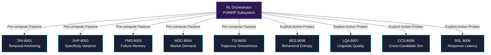

# Sentinal | KIVE - Knowledge Integrity Verification Engine

## Objective Structure

KIVE is a production-grade Reinforcement Learning (RL) expert fraud detection system. It formulates candidate vetting as a Partially Observable Markov Decision Process (POMDP). The agent ingests passive behavioral anomalies, sequentially collects active signals under uncertainty, and executes a terminal decision (PASS, REJECT, or FLAG).

The core technical premise isolates a fundamental constraint in generative capabilities: **AI-assisted human fraud is undetectable by perplexity analysis alone.** It must be identified through behavioral variances in professional consistency, specificity gaps, and operational memory, mapping anomalies against external ground truths rather than LLM intrinsic artifacts.

---

## Architectural Taxonomy



### Signal Framework

| Signal | Mode | Weight | Target Vector |
|--------|------|--------|---------------|
| **TAV** | Passive | 0.28 | Tool usage pre-dating initial public release parameters. |
| **SVP** | Passive | 0.24 | Uniform fluency density (LLM trait) against standard human variance domains. |
| **FMD** | Passive | 0.20 | Failure interpolation capability. LLMs fail to generate isolated technical incident narratives. |
| **BES** | Active  | 0.18 | Cryptographic payload verification via keystroke dynamics and clipboard entropy analysis. |
| **MDC** | Passive | 0.16 | Aggregated timeline alignment to historical market demand velocity. |
| **TSI** | Passive | 0.12 | Detection of purely monotonic progression profiles. |
| **LQA** | Active  | 0.10 | Syllabic hedging and localized grammar uniformities in live responses. |
| **CCS** | Active  | 0.08 | Collision parameters representing repetitive LLM sampling across candidates. |
| **RSL** | Active  | 0.07 | Standardized latency delta curve analysis mapping human temporal baseline constraints. |

### RL Engine Blueprint

- **Observation Mapping**: `Box(shape=(18,), float32)` incorporating continuous belief updates, binary probe status indicators, and sub-module certainty metrics.
- **Action Matrix**: `Discrete(7)` — [PASS, REJECT, FLAG, PROBE_BES, PROBE_LQA, PROBE_CCS, PROBE_RSL]
- **Asymmetric Vector Rewards**: Optimal configuration values derived empirically — FN=-2.5, FP=-1.0, TP/TN=+1.0, Probe=-0.02, Redundant Probe=-0.20.
- **Policy Infrastructure**: RecurrentPPO (sb3-contrib) configured for POMDPs with recurrent LSTM layers capturing non-Markovian signal sequences. Total target sequence length: 10,000 to 40,000 steps.

---

## Technical Implementation Guide

### 1. Unified Environment Boot

Ensure Docker deployment is executing in your container runtime context. The root-level `.dockerignore` handles namespace scoping.

```bash
docker-compose up -d --build
```

The unified deployment image maps across all 10 independent REST instances natively.

### 2. Dependency Initialization

Execute isolated python dependency synchronization for raw script operations, testing, or retraining pipelines.

```bash
uv sync
```

### 3. Data Synthesis Generation

Produce adversarial dataset instances matching precise density parameters required for RL boundary convergence.

```bash
uv run python data/synthetic_generator.py
uv run python data/validate_distribution.py
```

### 4. RL Agent Calibration

Invoke full RecurrentPPO training sequences.

```bash
uv run python services/orchestrator/train.py --n-episodes 10000 --no-mlflow
```

Generated metrics populate into `/artifacts/training/` encompassing:
- JSON Convergence Parameters
- State Action Episode Trace Charts
- Vectorized Learning Curve Differentials

### 5. Validation Architecture

Execute root pytest configurations.

```bash
uv run pytest tests/ -v
```
