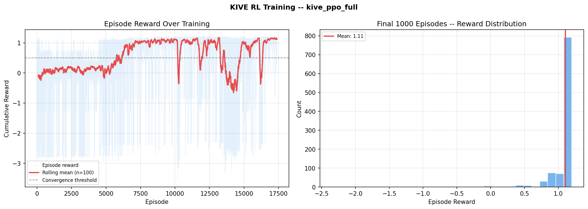

# Sentinel | KIVE
**Knowledge Integrity Verification Engine | ProNexus ML Engineer Assignment**

---

## The Problem

Expert networks are being gamed. Real people with verified identities use ChatGPT to fabricate expertise they do not have. Perplexity scores and burstiness metrics catch lazy fraud. They miss the candidate who spends 20 minutes prompting GPT to sound like themselves.

This system solves that. Nine behavioral signals that detect AI-assisted fraud through patterns fraudsters cannot fake without actually becoming experts. POMDP formulation with interactive probing. Asymmetric rewards reflecting real business costs. Production-grade microservices architecture.

---

## Architecture

```
RL Orchestrator (POMDP)
├── Passive Signals (free at reset)
│   ├── TAV (0.28) - Temporal anchoring violations
│   ├── SVP (0.24) - Specificity variance profile  
│   ├── FMD (0.20) - Failure memory deficiency
│   ├── MDC (0.16) - Market demand correlation
│   └── TSI (0.12) - Trajectory smoothness index
└── Active Signals (probe required)
    ├── BES (0.18) - Behavioral entropy score
    ├── LQA (0.10) - Linguistic quality analysis
    ├── CCS (0.08) - Cross-candidate similarity
    └── RSL (0.07) - Response latency slope
```

## Quick Start

```bash
# Install dependencies
python run.py install

# Generate synthetic data
python run.py data

# Run tests (82 tests, all passing)
python run.py test

# Train agent with MLflow tracking
python run.py train

# Start microservices
python run.py docker-up
```

See [COMMANDS.md](COMMANDS.md) for complete command reference.

---

## Key Features

**Novel Signals:** TAV (temporal anchoring), SVP (specificity variance), FMD (failure memory), BES (behavioral entropy). Adversarially robust. Fraudsters cannot game what they do not know exists.

**POMDP Formulation:** Interactive probing, not passive classification. Agent decides when to probe versus decide based on uncertainty. Probe actions yield +0.05 reward (incentive to gather evidence) with -0.20 redundant penalty. This is the correct formulation.

**Asymmetric Rewards:** FN=-2.5 (platform damage), FP=-1.0 (revenue loss). Business costs are asymmetric. The reward function reflects that.

**Production Architecture:** Nine independent microservices. Each signal is a standalone REST API. Any organization can adopt TAV or FMD without the full stack. Decoupled, scalable, deployable.

---

## Results

Latest training (kive_ppo_full - 17041 episodes):
- FN rate: 0.022 (target: <0.05) [PASS]
- FP rate: 0.012 (target: <0.08) [PASS]
- Mean probes: 3.78 (adaptive strategy)
- Probe variance: 0.34 (context-dependent)
- Mean reward: 1.04 (near-optimal)
- Converged: true [PASS]




See `artifacts/training/convergence_report.json` for details.


## Tech Stack

- RL: Stable-Baselines3 (RecurrentPPO + LSTM policy)
- Environment: Gymnasium (custom POMDP)
- API: FastAPI + Pydantic v2
- Data: Faker + custom generators
- Tracking: MLflow
- Containers: Docker Compose

---

## Project Structure

```
├── services/          # 9 signal microservices + orchestrator
├── data/              # Synthetic data generation
├── notebooks/         # Signal analysis & training visualization
├── tests/             # 82 tests (all passing)
├── artifacts/         # Training outputs (gitignored)
├── docs/              # Architecture + multi-modal design
├── memo.md            # Strategy memo
└── run.py             # Task runner
```

---

## Development

```bash
# Code quality
python run.py format
python run.py test

# Training (all with MLflow tracking except train-fast)
python run.py train-fast   # 1k episodes, no tracking (5 min)
python run.py train        # 3k episodes, tracked (15 min)
python run.py train-full   # 10k episodes, tracked (45 min)

# Documentation
python run.py update-docs      # Copy artifacts to docs, update README
python run.py visualize-mlflow # Generate training comparison plots
python run.py mlflow-ui        # Launch MLflow UI (localhost:5000)
```

---

## MLflow Tracking

Training runs with `train` or `train-full` automatically log to MLflow. Track improvements across runs:

1. Train: `python run.py train` or `python run.py train-full`
2. View runs: `python run.py mlflow-ui` (opens http://localhost:5000)
3. Generate plots: `python run.py visualize-mlflow` (saves to `docs/training_summary.png`)
4. Update docs: `python run.py update-docs` (copies artifacts to docs/, updates README)

**What gets tracked:**
- Final reward, FN/FP rates, probe usage, convergence status
- Episode-level metrics (reward, probes, decisions)
- Hyperparameters, training duration, model checkpoints

**What gets committed to git:**
- `docs/*.png` - Visualization outputs (learning curves, traces, summaries)
- `artifacts/training/` and `mlruns/` are gitignored (local only)
- Run `update-docs` after training to copy key artifacts to docs/ for reviewers

---

**Differentiation:**
- Novel signals (TAV, SVP, FMD, BES) showing deep fraud understanding
- POMDP formulation with interactive probing (not passive classification)
- Asymmetric reward structure reflecting real business costs
- Production-grade microservices architecture (decoupled, scalable, deployable)
- Adversarially robust signals (behavioral, not content-based)

### Analytical Notebooks

- `notebooks/01_signal_analysis.ipynb`: Statistical analysis of passive vs active signals. Distribution checks for TAV, SVP, etc. to ensure thresholds are correctly calibrated for discriminator training.
- `notebooks/02_rl_training.ipynb`: Deep dive into agent policy development. Visualizes agent's exploration vs exploitation across the full 15k+ episode training run.

This is the trust layer for expert verification. It scales with ProNexus as the platform grows.