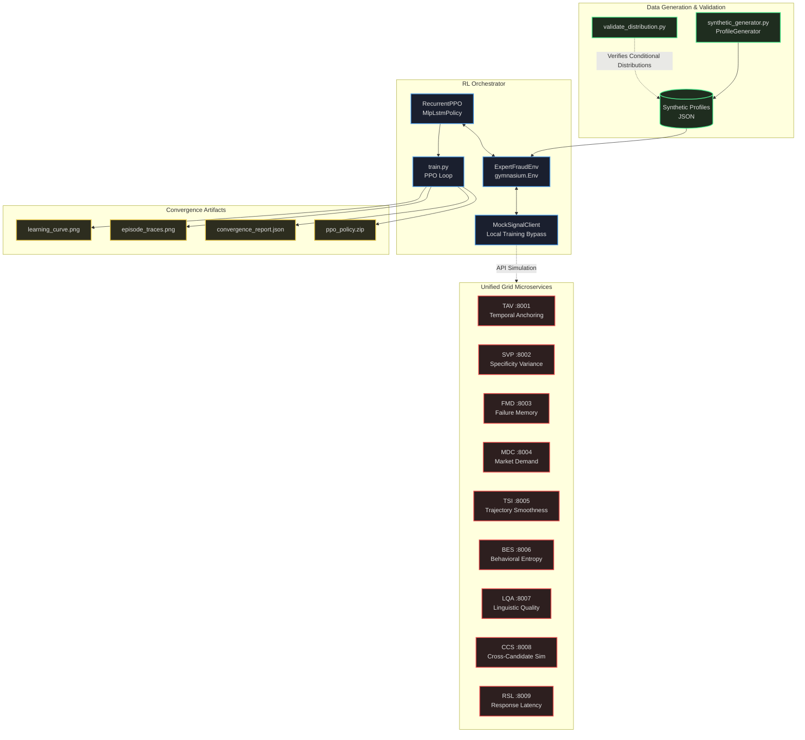
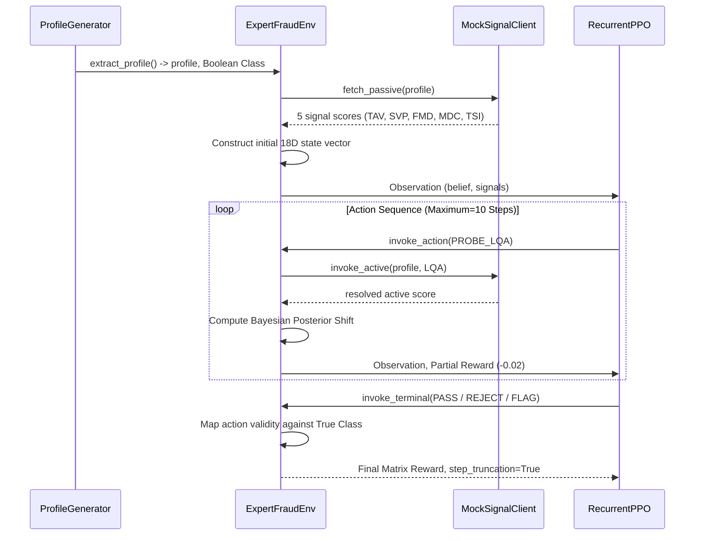
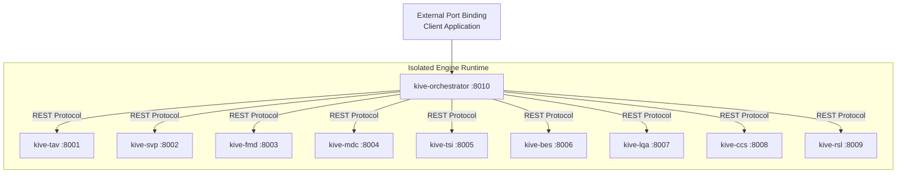

# KIVE System Architecture
**Technical Implementation | Production-Grade Fraud Detection**

---

## The Architecture Problem

Most fraud detection systems are monoliths. They couple signal logic to orchestration logic to deployment infrastructure. When one signal needs retraining, you redeploy everything. When a client wants only temporal anchoring verification, they cannot adopt it without the full stack.

This architecture solves that. Nine independent microservices. One orchestrator. Each signal is a standalone REST API with its own detector class, health endpoint, and Docker container. Any organization can run TAV or FMD in isolation. The orchestrator coordinates them but does not depend on them existing.

The POMDP formulation is not academic posturing. It is the only correct way to model this problem. You do not have full information at step zero. You acquire it sequentially by probing. The agent learns which probes reduce uncertainty fastest and when to stop collecting evidence.

---

## High-Level Pipeline

---

## Signal Detection Matrix

Each signal is an independent FastAPI service returning fraud probability in [0,1]. The weights are not arbitrary. They reflect information density per compute cost. TAV has the highest weight because temporal violations are binary and unfakeable. BES has lower weight because behavioral entropy requires more samples to converge.

| Signal | Execution | Weight | Core Focus |
|--------|-----------|--------|------------|
| **TAV** | Passive | 0.28   | Resume temporal inconsistencies |
| **SVP** | Passive | 0.24   | LLM linguistic uniformity |
| **FMD** | Passive | 0.20   | Lack of specific failure experiences |
| **MDC** | Passive | 0.16   | Retroactive skill inflation aligning to market trends |
| **TSI** | Passive | 0.12   | Resume monotonicity anomalies |
| **BES** | Active  | 0.18   | Keystroke entropy, UI event telemetry |
| **LQA** | Active  | 0.10   | Token sampling hedging artifacts |
| **CCS** | Active  | 0.08   | Cross-session payload overlaps |
| **RSL** | Active  | 0.07   | Standard latency divergence curves |

---

## POMDP State Transitions

The environment is a Partially Observable Markov Decision Process because the agent never sees ground truth during an episode. It sees noisy signals and must infer fraud probability through Bayesian updates. The LSTM policy is structurally necessary because probe history changes how you interpret new evidence. A feedforward network loses that dependency.

---

## Observation State Dimensions

The state vector is 18 dimensions. Every value is normalized to [0,1] for stable gradient flow. Passive signals initialize at episode reset. Active signals initialize at 0.5 (maximum uncertainty) and update only when probed. The binary probe flags prevent redundant queries. The normalized step counter prevents infinite loops.

| Matrix Vector | Attribute | Limits | Description |
|---|---|---|---|
| `[0]` | `fraud_belief` | `[0, 1]` | Bayesian posterior aggregation of all resolved signals. |
| `[1]` | `confidence` | `[0, 1]` | Relative density and variance agreement of the collected inputs. |
| `[2:6]` | `Passive Base` | `[0, 1]` | `[TAV, SVP, FMD, MDC, TSI]` - Populated upon environment reset condition. Standard initialization 0.5 where MNAR. |
| `[7:10]` | `Active Base` | `[0, 1]` | `[BES, LQA, CCS, RSL]` - Initialized to 0.5. Updated purely upon execution of discrete PROBE actions. |
| `[11]` | `Normalized Step` | `[0, 1]` | Ratio of elapsed discrete cycles versus `MAX_STEPS`. Prevents infinite recurrent loops. |
| `[12:15]` | `Binary Probes` | `{0, 1}` | Indication matrix signaling if `[PROBE_BES, PROBE_LQA, PROBE_CCS, PROBE_RSL]` have fired. |
| `[16]` | `Passive Belief` | `[0, 1]` | Discrete Bayesian weight of the 5 passive components alone. |
| `[17]` | `Active Belief` | `[0, 1]` | Discrete Bayesian weight of the probed components alone. |

---

## Discrete Action Space

Seven actions. Three terminal decisions (PASS, REJECT, FLAG). Four probe actions (BES, LQA, CCS, RSL). The reward structure is asymmetric because business costs are asymmetric. Admitting fraud destroys platform credibility (-2.5). Rejecting a real expert costs revenue (-1.0). Probing costs time (-0.02) but reduces uncertainty. Redundant probes are catastrophic (-0.20) because they waste resources without new information.

**Action Mapping `Discrete(7)`**:
- `0`: PASS
- `1`: REJECT
- `2`: FLAG
- `3`: PROBE_BES (Yields precise behavioral data)
- `4`: PROBE_LQA (Yields localized text analytics)
- `5`: PROBE_CCS (Cross-evaluates past instances)
- `6`: PROBE_RSL (Fetches high-confidence timing metrics)

**Cost Asymmetry**:
- True Positive / True Negative = `+1.0`
- False Negative (Fraud admitted) = `-2.5`
- False Positive (Expert denied) = `-1.0`
- Safe Default (Flagged) = `+0.3` (Hit), `-0.2` (Miss)
- Singular Probe execution = `-0.02`
- Redundant Probe Execution = `-0.20`

---

## Docker Container Infrastructure

Ten containers. Nine signal services plus one orchestrator. All derive from the same Dockerfile and requirements.txt. Zero redundancy. The orchestrator resolves service endpoints via Docker Compose internal DNS. No hardcoded IPs. No port conflicts. Each service exposes `/health` and `/api/v1/signals/{signal}`. Standard REST contracts. Any client can call them independently.

All 10 instances derive from one source `Dockerfile` referencing the shared `requirements.txt`. The Orchestrator resolves endpoints inherently via internal DNS mappings defined strictly in `docker-compose.yml` environment configurations, entirely negating local port conflicts.

---

## Production Roadmap

**Dynamic action masking:** Eliminate illegal actions at the policy level. If PROBE_BES already fired, mask it from the action distribution. Prevents redundant probes without penalty.

**Continuous action space:** Replace discrete probes with continuous confidence parameters. Instead of "probe BES or not", output "probe BES with confidence threshold 0.8". Reduces action space dimensionality.

**Vector database persistence:** Migrate session logs from JSON to pgvector or Chroma. Enables semantic search over historical fraud patterns. Supports continual learning from production data.

**Layer normalization:** Stabilize PPO value estimates by normalizing observation components. Prevents gradient explosion when belief updates are large.

**Real-time inference API:** Deploy trained policy as FastAPI endpoint. Input: candidate profile. Output: fraud probability + recommended probes. Latency target: <200ms per decision.
