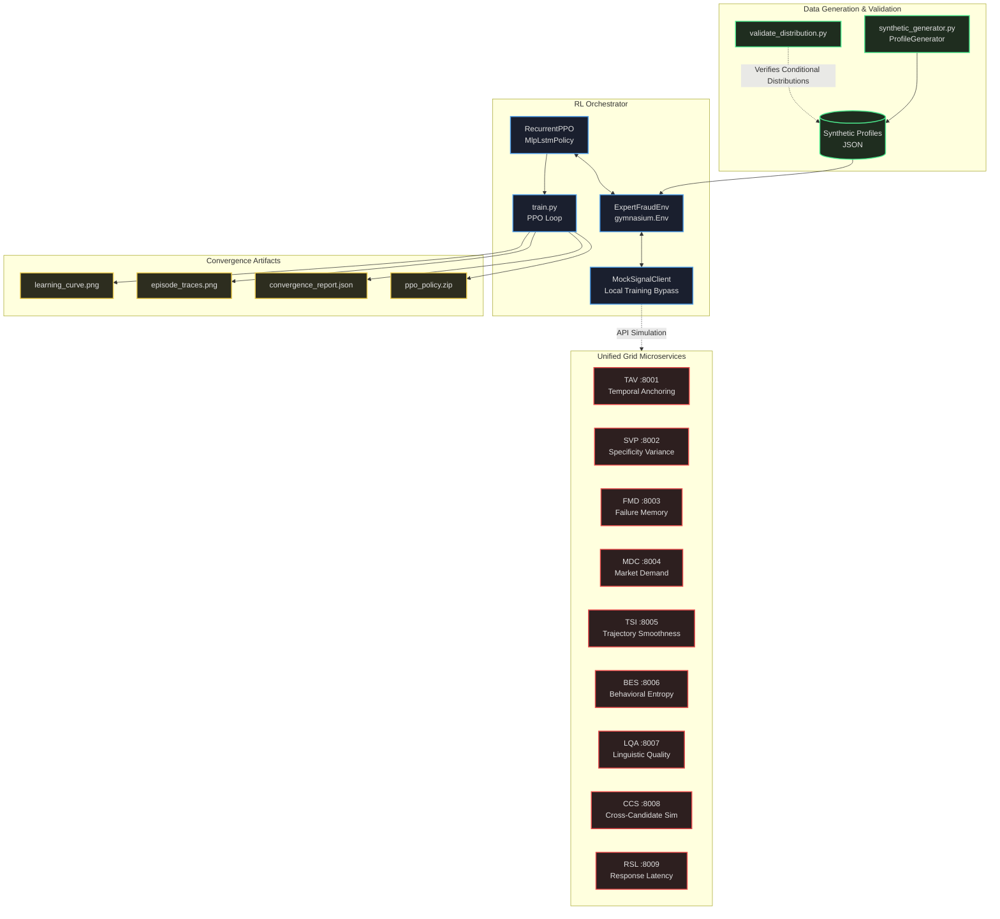
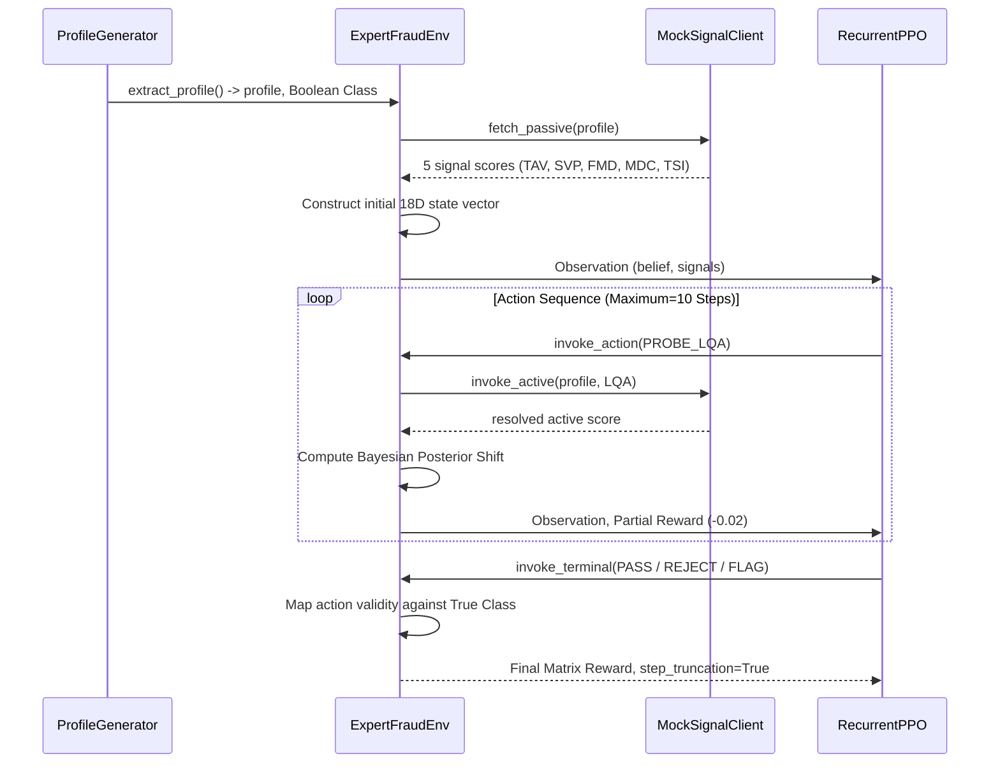
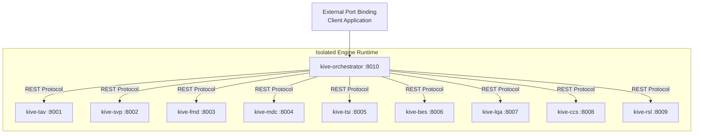

# KIVE System Architecture

## 1. High-Level Pipeline

---

## 2. Signal Detection Matrix

The core architecture runs on 9 distinct microservices handling isolated vector queries. Each returns a normalized fraud probability score `[0, 1]` coupled with internal confidence logic.

| Signal | Execution | Weight | Core Focus |
|--------|-----------|--------|------------|
| **TAV** | Passive | 0.28   | Resume temporal inconsistencies |
| **SVP** | Passive | 0.24   | LLM linguistic uniformity |
| **FMD** | Passive | 0.20   | Lack of specific failure experiences |
| **MDC** | Passive | 0.16   | Retroactive skill inflation aligning to market trends |
| **TSI** | Passive | 0.12   | Resume monotonicity anomalies |
| **BES** | Active  | 0.18   | Keystroke entropy, UI event telemetry |
| **LQA** | Active  | 0.10   | Token sampling hedging artifacts |
| **CCS** | Active  | 0.08   | Cross-session payload overlaps |
| **RSL** | Active  | 0.07   | Standard latency divergence curves |

---

## 3. POMDP State Transitions

---

## 4. Observation State Dimensions

The POMDP represents the environment as an 18-dimensional multimodal continuous vector space. All values are scaled within `[0, 1]`.

| Matrix Vector | Attribute | Limits | Description |
|---|---|---|---|
| `[0]` | `fraud_belief` | `[0, 1]` | Bayesian posterior aggregation of all resolved signals. |
| `[1]` | `confidence` | `[0, 1]` | Relative density and variance agreement of the collected inputs. |
| `[2:6]` | `Passive Base` | `[0, 1]` | `[TAV, SVP, FMD, MDC, TSI]` - Populated upon environment reset condition. Standard initialization 0.5 where MNAR. |
| `[7:10]` | `Active Base` | `[0, 1]` | `[BES, LQA, CCS, RSL]` - Initialized to 0.5. Updated purely upon execution of discrete PROBE actions. |
| `[11]` | `Normalized Step` | `[0, 1]` | Ratio of elapsed discrete cycles versus `MAX_STEPS`. Prevents infinite recurrent loops. |
| `[12:15]` | `Binary Probes` | `{0, 1}` | Indication matrix signaling if `[PROBE_BES, PROBE_LQA, PROBE_CCS, PROBE_RSL]` have fired. |
| `[16]` | `Passive Belief` | `[0, 1]` | Discrete Bayesian weight of the 5 passive components alone. |
| `[17]` | `Active Belief` | `[0, 1]` | Discrete Bayesian weight of the probed components alone. |

---

## 5. Discrete Action Configuration

The action space consists of 7 explicit channels balancing final validation decisions against recursive data acquisition.

**Action Mapping `Discrete(7)`**:
- `0`: PASS
- `1`: REJECT
- `2`: FLAG
- `3`: PROBE_BES (Yields precise behavioral data)
- `4`: PROBE_LQA (Yields localized text analytics)
- `5`: PROBE_CCS (Cross-evaluates past instances)
- `6`: PROBE_RSL (Fetches high-confidence timing metrics)

**Cost Asymmetry**:
- True Positive / True Negative = `+1.0`
- False Negative (Fraud admitted) = `-2.5`
- False Positive (Expert denied) = `-1.0`
- Safe Default (Flagged) = `+0.3` (Hit), `-0.2` (Miss)
- Singular Probe execution = `-0.02`
- Redundant Probe Execution = `-0.20`

---

## 6. Docker Container Infrastructure

The services leverage a single logical root map utilizing YAML component inheritance to achieve zero-redundancy scaling.

All 10 instances derive from one source `Dockerfile` referencing the shared `requirements.txt`. The Orchestrator resolves endpoints inherently via internal DNS mappings defined strictly in `docker-compose.yml` environment configurations, entirely negating local port conflicts.

---

## 7. Operational Roadmap Expansion

- **State Distribution Normalization:** Introduce Layer Normalization across the Bayesian observation components to stabilize PPO value calculations further.
- **Continuous Action Migration:** Extend Action outputs from isolated discrete selections to continuous multi-probe arrays resolving confidence parameters intrinsically within a single iteration.
- **Real-Time Database Persistence:** Migrate the raw session logging within the Orchestrator `main.py` state dictionaries to a permanent scalable vector backend store (e.g. pgvector, Chroma) for post-mortem analysis and retraining cycles.
- **Dynamic Action Masking:** Completely eliminate the possibility of selecting `PROBE_BES` when binary probe indicator `[12]` is active, enforcing 100% legal actions logically at the agent probability level.
